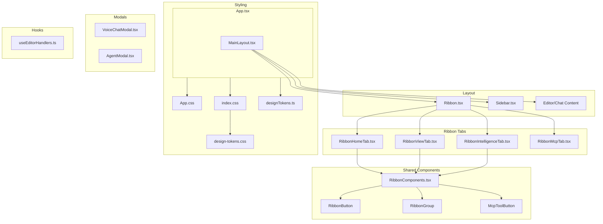

# G-Studio UI/UX Overhaul Implementation Plan

**Version:** 1.0  
**Date:** February 11, 2025  
**Target:** Desktop-primary (1920×1080+), English-first, macOS-style glassmorphism

---

## 1. Overview & Goals

### Summary

This plan outlines a major UI/UX overhaul for G-Studio: an Electron+React SPA IDE. The overhaul shifts the app from a mixed Persian/English interface to a consistent English-first experience, introduces macOS Big Sur+ style glassmorphism, enforces a proper typography hierarchy, and redesigns the Explorer bar and Ribbon (Toolbox) for better proportions, spacing, and visual consistency.

### Goals

| Goal               | Description                                                                                                                               |
| ------------------ | ----------------------------------------------------------------------------------------------------------------------------------------- |
| **Localization**   | Translate all user-facing strings from Persian to English (40+ strings across VoiceChatModal, useEditorHandlers, and other UI components) |
| **Glassmorphism**  | Implement macOS-style vibrant blur and frosted glass effects across the app                                                               |
| **Typography**     | Create and enforce a font hierarchy using existing design tokens                                                                          |
| **Explorer Bar**   | Redesign Sidebar layout, icons, and interactions                                                                                          |
| **Toolbox/Ribbon** | Fix proportions, padding, and visual design                                                                                               |
| **Responsive**     | Desktop-primary (1920×1080+) with proper scaling down                                                                                     |
| **Spacing**        | Use design tokens systematically for consistency                                                                                          |

### Component Structure



---

## 2. Design System Foundation

### 2.1 Typography Scale Implementation

**Current State:** Mixed usage of `text-xs`, `text-sm`, `text-base` with hardcoded values. Design tokens exist in `src/theme/designTokens.ts` but are underutilized.

**Target Implementation:**

```css
/* Add to index.css or design-tokens.css */
:root {
  /* Typography scale from designTokens */
  --font-size-xs: 0.75rem; /* 12px - captions, labels */
  --font-size-sm: 0.875rem; /* 14px - body secondary */
  --font-size-md: 1rem; /* 16px - body default */
  --font-size-lg: 1.125rem; /* 18px - subheadings */
  --font-size-xl: 1.25rem; /* 20px - section titles */
  --font-size-2xl: 1.5rem; /* 24px - page titles */
  --font-size-3xl: 1.875rem; /* 30px - display */
  --font-size-4xl: 2.25rem; /* 36px - hero */

  /* Font weights (from designTokens) */
  --font-weight-light: 300;
  --font-weight-normal: 400;
  --font-weight-medium: 500;
  --font-weight-semibold: 600;
  --font-weight-bold: 700;

  /* Line heights */
  --line-height-tight: 1.2;
  --line-height-normal: 1.5;
  --line-height-relaxed: 1.75;
}
```

**Usage:** Replace ad-hoc `text-[10px]`, `text-[11px]` with semantic classes: `text-caption`, `text-body-sm`, `text-heading-md`, etc.

**Files to modify:**

- `src/theme/designTokens.ts` — Add export for typography utility classes
- `index.css` — Add typography utility classes
- `src/styles/design-tokens.css` — Ensure CSS variables are exported

### 2.2 Enhanced Glassmorphism System (macOS-Style)

**Current State:**

- `App.css`: `.glass`, `.glass-subtle`, `.glass-icon` (basic blur, hardcoded dark colors)
- `index.css`: `.glass-panel` (light-only, no theme awareness)

**Target Implementation (macOS Big Sur+):**

```css
/* Enhanced glass variants */
.glass {
  background: var(--glass-bg);
  backdrop-filter: saturate(180%) blur(20px);
  -webkit-backdrop-filter: saturate(180%) blur(20px);
  border: 1px solid var(--glass-border);
  box-shadow: var(--glass-shadow);
}

.glass-subtle {
  background: var(--glass-bg-subtle);
  backdrop-filter: saturate(150%) blur(12px);
  -webkit-backdrop-filter: saturate(150%) blur(12px);
  border: 1px solid var(--glass-border-subtle);
}

.glass-icon {
  background: var(--glass-bg-icon);
  backdrop-filter: saturate(180%) blur(8px);
  -webkit-backdrop-filter: saturate(180%) blur(8px);
  border: 1px solid var(--glass-border-icon);
}

/* Light theme glass overrides */
[data-theme="light"] {
  --glass-bg: rgba(255, 255, 255, 0.72);
  --glass-bg-subtle: rgba(255, 255, 255, 0.55);
  --glass-bg-icon: rgba(255, 255, 255, 0.15);
  --glass-border: rgba(0, 0, 0, 0.06);
  --glass-shadow: 0 8px 32px rgba(0, 0, 0, 0.08);
}
```

**Key changes:**

- Add `saturate()` for vibrancy (macOS characteristic)
- Increase blur radius (16px → 20px for primary glass)
- Theme-aware variables for light/dark
- Add `.glass-panel` dark mode support

**Files:** `src/App.css`, `index.css`, `src/styles/design-tokens.css` (if exists)

### 2.3 Spacing & Padding System

**Current State:** Inconsistent use of `px-2`, `py-1.5`, `gap-6`, etc. Design tokens define `spacing.xs` through `spacing.4xl` (8px base).

**Target:** Use CSS variables for spacing:

```css
:root {
  --space-1: 0.25rem; /* 4px */
  --space-2: 0.5rem; /* 8px */
  --space-3: 0.75rem; /* 12px */
  --space-4: 1rem; /* 16px */
  --space-5: 1.25rem; /* 20px */
  --space-6: 1.5rem; /* 24px */
  --space-8: 2rem; /* 32px */
  --space-10: 2.5rem; /* 40px */
}
```

**Component conventions:**

- Ribbon header: `h-11` (44px) — keep
- Ribbon content padding: `px-5 py-3.5` (20px/14px) — align to `--space-5`, `--space-3`
- Sidebar header: `h-[52px]` — standardize to `--space-13` (52px) or `2.75rem`
- Button padding: `p-2.5` (10px) — use `--space-2.5`

### 2.4 Responsive Breakpoints Strategy

**Target:** Desktop-primary. Breakpoints from `designTokens.breakpoints`:

| Breakpoint | Min Width | Use Case             |
| ---------- | --------- | -------------------- |
| xs         | 320px     | Minimum (fallback)   |
| sm         | 640px     | Compact sidebar      |
| md         | 768px     | Standard editor      |
| lg         | 1024px    | Full Ribbon expanded |
| xl         | 1280px    | Default target       |
| 2xl        | 1536px    | Large displays       |

**Scaling approach:**

- Base layout at 1920×1080
- At lg (1024px): Collapse Ribbon by default, reduce Sidebar width
- At md (768px): Hide Sidebar by default, show as overlay
- Use `clamp()` for fluid typography where appropriate

---

## 3. Translation Strategy

### 3.1 Files Requiring Translation

| File                                       | Persian Strings               | Priority |
| ------------------------------------------ | ----------------------------- | -------- |
| `src/components/modals/VoiceChatModal.tsx` | 18+                           | High     |
| `src/hooks/useEditorHandlers.ts`           | 11                            | High     |
| `src/hooks/voice/useVoiceCommands.tsx`     | ~60 (patterns + descriptions) | Medium\* |
| `src/components/modals/AgentModal.tsx`     | 2 (option labels)             | Low      |
| `src/services/agentOrchestrator.ts`        | Comments only                 | Low      |
| `src/theme/designTokens.ts`                | 1 (comment)                   | Low      |
| `src/services/tokenOptimizer.ts`           | Comments only                 | Low      |
| `src/services/VoskSpeechService.ts`        | 1 (comment)                   | Low      |

\*Voice commands: Keep Persian patterns for fa-IR recognition; translate descriptions and examples to English for UI display.

### 3.2 Specific Strings to Translate

**VoiceChatModal.tsx:**
| Persian | English |
|---------|---------|
| گفتگوی صوتی | Voice Chat |
| تنظیم کلید API | API Key Setup |
| لطفاً کلید API گوگل جمینی خود را وارد کنید | Please enter your Google Gemini API key |
| کلید API را اینجا وارد کنید... | Enter API key here... |
| دریافت کلید API از Google AI Studio | Get API key from Google AI Studio |
| برای شروع گفتگو، دکمه میکروفون را فشار دهید | Press the microphone button to start chatting |
| خطا در دریافت پاسخ | Error receiving response |
| اتصال به Gemini برقرار نشد | Could not connect to Gemini |
| در حال فکر کردن... | Thinking... |
| در حال گوش دادن... | Listening... |
| برای توقف ضبط کلیک کنید | Click to stop recording |
| برای شروع ضبط کلیک کنید | Tap microphone to speak |
| تغییر به فارسی | Switch to Persian |

**useEditorHandlers.ts:**
| Persian | English |
|---------|---------|
| به خط N رفتید | Jumped to line N |
| عملیاتی برای تکرار وجود ندارد | Nothing to redo |
| عملیات تکرار انجام شد | Redo complete |
| هیچ فایلی باز نیست | No file is open |
| پاک کردن ویرایشگر | Clear Editor |
| آیا مطمئن هستید... | Are you sure you want to close all files? Unsaved changes will be lost. |
| ویرایشگر پاک شد | Editor cleared |
| فایل‌ها از حافظه بازیابی شدند | Files restored from memory |
| فایل ذخیره شده‌ای یافت نشد | No saved file found |
| خطا در بازیابی فایل‌ها | Error restoring files |

### 3.3 Font Family Updates

**Remove Vazir, standardize on Inter:**

| File                                   | Current                     | Change                                                               |
| -------------------------------------- | --------------------------- | -------------------------------------------------------------------- |
| `src/theme/designTokens.ts`            | `'Inter','Vazir',...`       | `'Inter', system-ui, -apple-system, 'Segoe UI', sans-serif`          |
| `src/theme/themeSystem.tsx`            | `'Inter', 'Vazir',...`      | `'Inter', -apple-system, BlinkMacSystemFont, 'Segoe UI', sans-serif` |
| `src/components/layout/MainLayout.tsx` | `font-['Inter','Vazir']`    | `font-['Inter',system-ui,sans-serif]`                                |
| `index.css`                            | `--font-farsi: 'Vazir',...` | Remove or keep only for RTL fallback (optional)                      |
| `src/components/chat/InputArea.tsx`    | `Vazir, Tahoma, Arial`      | `Inter, system-ui, sans-serif`                                       |

**Ensure Inter is loaded:** Add to `index.html` or `App.tsx`:

```html
<link rel="preconnect" href="https://fonts.googleapis.com" />
<link rel="preconnect" href="https://fonts.gstatic.com" crossorigin />
<link
  href="https://fonts.googleapis.com/css2?family=Inter:wght@300;400;500;600;700&display=swap"
  rel="stylesheet"
/>
```

---

## 4. Component Redesigns

### 4.1 Explorer Bar (Sidebar.tsx)

**File:** `src/components/layout/Sidebar.tsx`

**Current Issues:**

- Activity bar (68px) uses `.glass` but has inconsistent border/background
- Side panel drawer (300px) uses `.glass-subtle` — good base
- Header height `h-[52px]` is hardcoded
- Search input styling differs from design tokens
- File tree items: mixed `text-xs`, `text-[10px]`, `text-[11px]`
- Empty state uses gradient overlays — could use glass
- Tooltips use `bg-slate-800` — should use glass for consistency

**Specific Changes:**

| Area               | Change                                                                       |
| ------------------ | ---------------------------------------------------------------------------- |
| Activity bar width | Keep 68px; ensure glass applies to both light/dark                           |
| Activity buttons   | Standardize `min-w-[44px]` to `--space-11` (44px); use design token radius   |
| Side panel header  | Use `--font-size-sm`, `--font-weight-semibold` from tokens                   |
| Search placeholder | "Search files..." (already English)                                          |
| File tree items    | Use `text-body-sm` (14px) for file names, `text-caption` (12px) for metadata |
| Empty state        | Apply `.glass-subtle` to container; "No Files Found", "Start by creating..." |
| Section labels     | "Bookmarked", "Recent" — use `text-caption` + `uppercase tracking-wider`     |
| Footer button      | "Clear Chat History" — ensure consistent padding                             |

**Icons:**

- Use lucide-react consistently (already done)
- Ensure icon size: `w-3.5 h-3.5` for tree items, `w-5 h-5` for activity bar

### 4.2 Ribbon / Toolbox

**Files:** `src/components/layout/Ribbon.tsx`, `src/components/ribbon/RibbonComponents.tsx`, `src/components/ribbon/RibbonHomeTab.tsx`, etc.

**Current Issues:**

- Ribbon height: `h-[150px]` expanded, `h-[80px]` collapsed — proportions feel cramped
- Content area: `px-5 py-3.5` — inconsistent with header
- Tab buttons: `px-3 py-1.5` — small touch targets
- RibbonButton: `min-w-[40px] min-h-[40px]` — OK, but padding varies
- RibbonGroup labels: `text-[10px]` — should use `--font-size-xs`
- McpToolButton: `min-w-[48px]` — align with spacing scale
- RibbonDivider: `h-14` — may not align with expanded content

**Specific Changes:**

| Component        | Change                                                                   |
| ---------------- | ------------------------------------------------------------------------ |
| Ribbon container | Expanded: `h-[160px]` or `h-[170px]` for breathing room; use `--space-*` |
| Header bar       | `h-11` (44px) — keep; ensure `px-4` aligns to `--space-4`                |
| Tab buttons      | `px-4 py-2` for better touch targets; use `--radius-md`                  |
| Content area     | `px-6 py-4` (24px/16px); `gap-10` → `gap-8` or `gap-12` for consistency  |
| RibbonGroup      | Label: `text-xs font-semibold uppercase tracking-wider` (from tokens)    |
| RibbonButton     | `p-2.5` → use `--space-2.5`; ensure `rounded-xl` matches `--radius-lg`   |
| RibbonDivider    | Height match content: `h-[calc(100%-var(--space-4))]` or fixed `h-16`    |

**Visual polish:**

- Background gradient overlay: reduce opacity for cleaner look
- Shimmer effect: keep but ensure it doesn't conflict with glass
- Theme toggle: already uses `glass-icon` — good

### 4.3 Icons

**Current:** lucide-react + custom SVG (Icons.tsx)

**Changes:**

- Standardize stroke width: `2` for primary, `1.5` for secondary
- Size scale: `w-3 h-3` (12px), `w-4 h-4` (16px), `w-5 h-5` (20px)
- Ensure hover states use design token colors (`--accent-primary`, etc.)

---

## 5. Implementation Phases

### Phase 1: Foundation (Design Tokens, CSS)

**Duration:** 1–2 days

| Task                         | Files                            | Notes                               |
| ---------------------------- | -------------------------------- | ----------------------------------- |
| Add typography CSS variables | `index.css`, `design-tokens.css` | From designTokens                   |
| Add spacing CSS variables    | `index.css`                      | Map to designTokens.spacing         |
| Enhance glassmorphism        | `App.css`, `index.css`           | macOS-style saturate + blur         |
| Add light theme glass vars   | `App.css`                        | Override for `[data-theme="light"]` |
| Ensure Inter font loads      | `index.html` or `App.tsx`        | Preconnect + link                   |

### Phase 2: Core Components

**Duration:** 2–3 days

| Task                        | Files                                                                   | Notes                               |
| --------------------------- | ----------------------------------------------------------------------- | ----------------------------------- |
| Translate VoiceChatModal    | `VoiceChatModal.tsx`                                                    | All 18+ strings                     |
| Translate useEditorHandlers | `useEditorHandlers.ts`                                                  | 11 strings                          |
| Apply font family updates   | `designTokens.ts`, `themeSystem.tsx`, `MainLayout.tsx`, `InputArea.tsx` | Remove Vazir                        |
| Redesign Sidebar            | `Sidebar.tsx`                                                           | Apply tokens, fix layout            |
| Redesign Ribbon             | `Ribbon.tsx`, `RibbonComponents.tsx`                                    | Proportions, padding                |
| Redesign Ribbon tabs        | `RibbonHomeTab.tsx`, `RibbonViewTab.tsx`, etc.                          | Use RibbonGroup/Button consistently |

### Phase 3: Polish & Testing

**Duration:** 1–2 days

| Task                                  | Files                  | Notes                                            |
| ------------------------------------- | ---------------------- | ------------------------------------------------ |
| Translate AgentModal options          | `AgentModal.tsx`       | 2 strings                                        |
| Translate useVoiceCommands UI strings | `useVoiceCommands.tsx` | descriptions, examples (keep patterns for fa-IR) |
| Audit remaining Persian               | Grep `[\u0600-\u06FF]` | Comments can stay                                |
| Responsive testing                    | All                    | 1920×1080, 1366×768, 1024×768                    |
| Accessibility check                   | All                    | Contrast, focus states                           |

---

## 6. Technical Details

### 6.1 CSS/Styling Approach

- **Primary:** Tailwind CSS with design token CSS variables
- **Where Tailwind falls short:** Use custom classes in `App.css` or `index.css` (e.g. `.glass`, `.glass-subtle`)
- **Theme switching:** `[data-theme="dark"]` and `[data-theme="light"]` on `document.documentElement` or `#root`
- **No new dependencies** — use existing Tailwind + CSS variables

### 6.2 Component Modification Approach

- **Prefer composition:** Keep RibbonGroup, RibbonButton, etc. as primitives
- **Avoid inline styles** where a Tailwind class or CSS variable exists
- **Use `@apply` sparingly** — prefer utility classes for maintainability
- **Dark mode:** Rely on CSS variables; avoid conditional `className` for theme colors

### 6.3 Testing Considerations

| Test Type         | Scope                                                      |
| ----------------- | ---------------------------------------------------------- |
| Visual regression | Screenshot Sidebar, Ribbon, VoiceChatModal at 1920×1080    |
| Responsive        | Verify at 1024px, 768px; Sidebar collapse, Ribbon collapse |
| Theme toggle      | Light/dark glass effects, contrast                         |
| Translation       | All user-facing strings in English                         |
| Font loading      | Inter renders correctly; no FOUT                           |
| Accessibility     | Focus visible, aria-labels, keyboard nav                   |

---

## Appendix A: File Path Reference

```
src/
├── App.css
├── theme/
│   ├── designTokens.ts
│   └── themeSystem.tsx
├── components/
│   ├── layout/
│   │   ├── MainLayout.tsx
│   │   ├── Sidebar.tsx
│   │   └── Ribbon.tsx
│   ├── ribbon/
│   │   ├── RibbonComponents.tsx
│   │   ├── RibbonHomeTab.tsx
│   │   ├── RibbonViewTab.tsx
│   │   ├── RibbonIntelligenceTab.tsx
│   │   └── RibbonMcpTab.tsx
│   ├── modals/
│   │   ├── VoiceChatModal.tsx
│   │   └── AgentModal.tsx
│   └── chat/
│       └── InputArea.tsx
├── hooks/
│   ├── useEditorHandlers.ts
│   └── voice/
│       └── useVoiceCommands.tsx
index.css
styles/
└── design-tokens.css
```

---

## Appendix B: Quick Reference – Persian → English

| Persian                       | English                     |
| ----------------------------- | --------------------------- |
| گفتگوی صوتی                   | Voice Chat                  |
| تنظیم کلید API                | API Key Setup               |
| به خط N رفتید                 | Jumped to line N            |
| عملیاتی برای تکرار وجود ندارد | Nothing to redo             |
| عملیات تکرار انجام شد         | Redo complete               |
| هیچ فایلی باز نیست            | No file is open             |
| پاک کردن ویرایشگر             | Clear Editor                |
| ویرایشگر پاک شد               | Editor cleared              |
| خطا در دریافت پاسخ            | Error receiving response    |
| اتصال به Gemini برقرار نشد    | Could not connect to Gemini |
| در حال فکر کردن...            | Thinking...                 |
| در حال گوش دادن...            | Listening...                |
| برای توقف ضبط کلیک کنید       | Click to stop recording     |
| برای شروع ضبط کلیک کنید       | Tap microphone to speak     |

---

_End of Implementation Plan_
